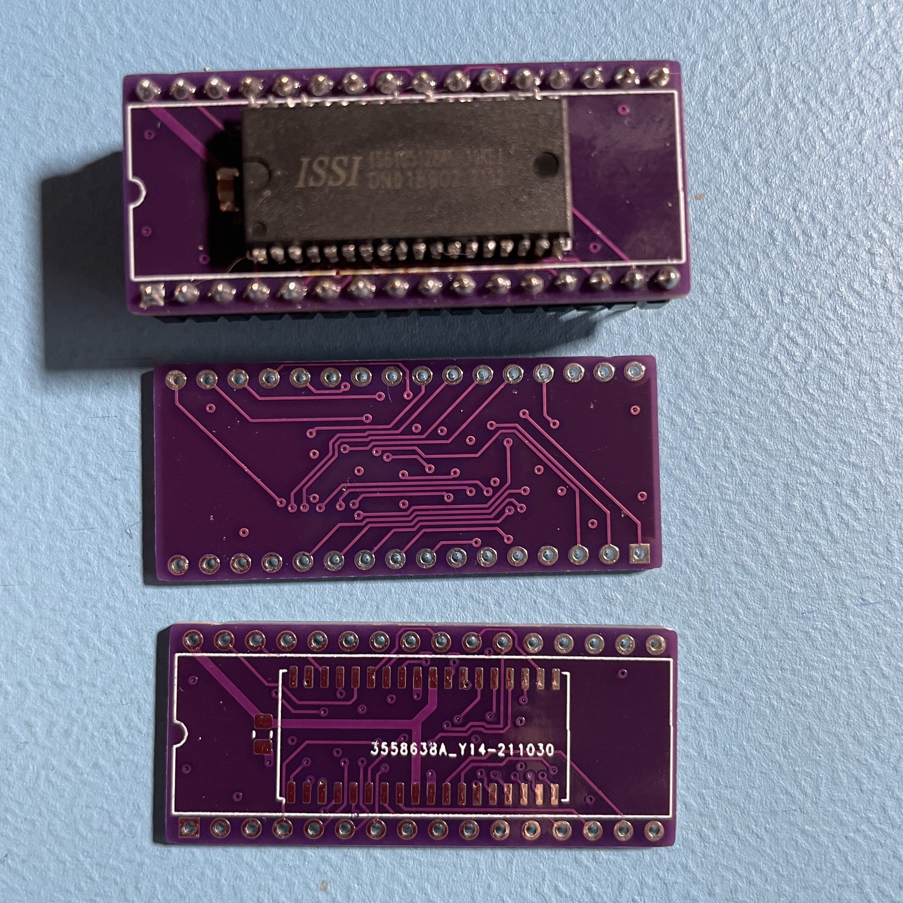

# sram_soj36_to_dip

This project converts an IS61C5128AL (SOJ-36) SRAM to an AS6C4008 (DIP-32) SRAM. It includes pinout conversion so the final pinout is the one of a AS6C4008 chip, allowing drop-in replacement with a faster chip (eg. 55ns to 10ns). Hand-soldering the chip is doable with a thin solder wire (I used 0.38mm solder wire for this). A spot for a 0.1uF decoupling capacitor is also provided.

## End result

## Schematic

